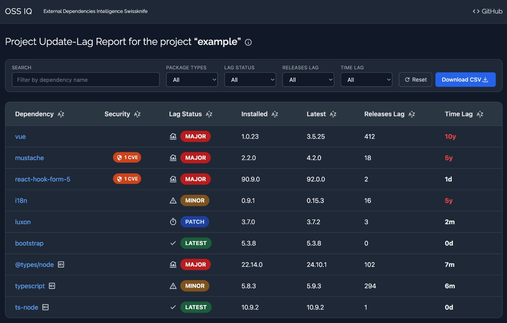

# OSS IQ

[](https://pypi.org/project/ossiq)
[](https://www.gnu.org/licenses/agpl-3.0)

> Know Your Dependency Risk in Minutes, Not Weeks.

**OSS IQ** is a free & open-source CLI tool that provides deep visibility into the risk profile of your open-source ecosystem. It helps you understand your dependency drift at scale by analyzing both direct and transitive dependencies to identify security vulnerabilities and maintenance "red flags" before they reach production.



## What is OSS IQ?

In a typical project with hundreds of dependencies, how do you answer these questions?
- How many dependencies have critical vulnerabilities?
- How far behind the latest versions are we?
- Which packages are unmaintained or abandoned?

`npm audit` tells you about vulnerabilities, but not which ones matter. Your framework might be years old, turning a simple upgrade into a multi-week project. Without a centralized view, you are always reacting, not planning.

OSS IQ bridges the gap between raw dependency data and actionable intelligence. It analyzes version lag, CVEs, transitive dependencies, and maintainer activity to produce a single, holistic health score for your project.

## How It Works

1.  **Run OSS IQ**: Point the CLI to your project's manifest file (`package.json`, `pyproject.toml`, etc.). OSS IQ supports NPM and Python (uv, Poetry, pip).
2.  **Analyze Everything**: The tool cross-references version lag, CVEs, and maintainer activity against public databases in real-time.
3.  **Get Your Report**: See a high-level health score and drill down into specific risks. The output is available as a rich console summary, an interactive HTML report, JSON, or a CycloneDX SBOM.
4.  **Build Quality Gates**: Use the metrics and scores to set policies and build automated quality gates in your CI/CD pipelines.

## Quick Start

### 1. GitHub Token (Required)

OSS IQ performs deep analysis by mining software repository history, which can involve hundreds of API requests to GitHub. To avoid being rate-limited, you need to provide a GitHub Personal Access Token (PAT).

```bash
export OSSIQ_GITHUB_TOKEN=$(gh auth token)
```

### 2. Installation & Analysis

You can clone the repository and run the tool in development mode.

```bash
# Clone the repository
git clone https://github.com/ossiq/ossiq.git
cd ossiq

# Install dependencies
uv sync

# Run your first analysis
uv run hatch run ossiq-cli overview /path/to/your/project
```

OSS IQ automatically detects the dependency manifest (`package.json`, `pyproject.toml`, etc.) in the target directory.

## Example Output

Here is an example of the summary provided in your console:

```
╭─────────────────────────────────────────╮
│ 📦 Project: example                     │
│ 🔗 Packages Registry: NPM               │
│ 📍 Project Path: testdata/npm/project1/ │
╰─────────────────────────────────────────╯


                        Production Packages Version Status                           
┏━━━━━━━━━━━━━━━━━━━┳━━━━━━┳━━━━━━━━━━━━┳━━━━━━━━━━━┳━━━━━━━━┳━━━━━━━━━━━━━┳━━━━━━━━━━┓
┃ Dependency        ┃ CVEs ┃ Lag Status ┃ Installed ┃ Latest ┃ Release Lag ┃ Time Lag ┃
┡━━━━━━━━━━━━━━━━━━━╇━━━━━━╇━━━━━━━━━━━━╇━━━━━━━━━━━╇━━━━━━━━╇━━━━━━━━━━━━━╇━━━━━━━━━━┩
│ react-hook-form-5 │  1   │    N/A     │ 90.9.0    │ N/A    │           2 │       0d │
│ mustache          │  1   │   Major    │ 2.2.0     │ 4.2.0  │          18 │       5y │
│ vue               │      │   Major    │ 1.0.23    │ 3.5.25 │         413 │      10y │
│ i18n              │      │   Minor    │ 0.9.1     │ 0.15.3 │          16 │       5y │
│ luxon             │      │   Patch    │ 3.7.0     │ 3.7.2  │           3 │       2m │
│ bootstrap         │      │   Latest   │ 5.3.8     │ 5.3.8  │           0 │       0d │
└───────────────────┴──────┴────────────┴───────────┴────────┴─────────────┴──────────┘
```

## Key Features

-   **Security Blind Spots**: Go beyond `npm audit` to see which vulnerabilities actually matter and how to prioritize them.
-   **Silent Tech Debt**: Track your version lag in releases and in time (e.g., "your React version is 2 years old") to quantify technical debt.
-   **Multiple Output Formats**: Generate reports as interactive HTML, JSON, CycloneDX SBOMs, or a rich console view.
-   **CI/CD Integration**: Use scores and metrics to build quality gates and enforce dependency policies automatically.

## Supported Ecosystems

### NPM

**Supported:**
- **[npm](https://docs.npmjs.com/cli/v11/commands/npm)** – Package manager for JavaScript (`package.json` + `package-lock.json`)

### Python

**Supported:**
- **[uv](https://docs.astral.sh/uv/)** – Fast Rust-based package manager (`pyproject.toml` + `uv.lock`)
- **[pip lock](https://pip.pypa.io/en/stable/cli/pip_lock/)** – [pylock.toml](https://packaging.python.org/en/latest/specifications/pylock-toml/#pylock-toml-spec) lockfile format (`pyproject.toml` + `pylock.toml`)
- **[pip classic](https://pip.pypa.io/en/stable/reference/requirements-file-format/)** – Traditional `requirements.txt` (best with `pip freeze` output)

**Not yet supported:**
- **[Poetry](https://python-poetry.org/)** – Consider exporting to `pylock.toml` as a workaround ([discussion](https://github.com/orgs/python-poetry/discussions/10322))

### Limitations
 - Transitive dependencies are not yet supported

## FAQ

**How is this different from `npm audit` or `pip-audit`?**
Audit tools are great at finding known vulnerabilities. OSS IQ goes further by also analyzing non-security risks, such as how far behind you are from the latest version (technical debt) and whether a package is still actively maintained. We give you the full picture of dependency health, not just one part of it.

**What ecosystems does OSS IQ support?**
OSS IQ currently supports npm for JavaScript and multiple dependency managers for Python (like uv, Poetry, and classic pip).

**Is OSS IQ free?**
Yes, OSS IQ is a completely free and open-source tool, licensed under the AGPL v3 license.

## License

This project is licensed under the **GNU Affero General Public License v3.0**. See the [LICENSE](LICENSE) file for details.