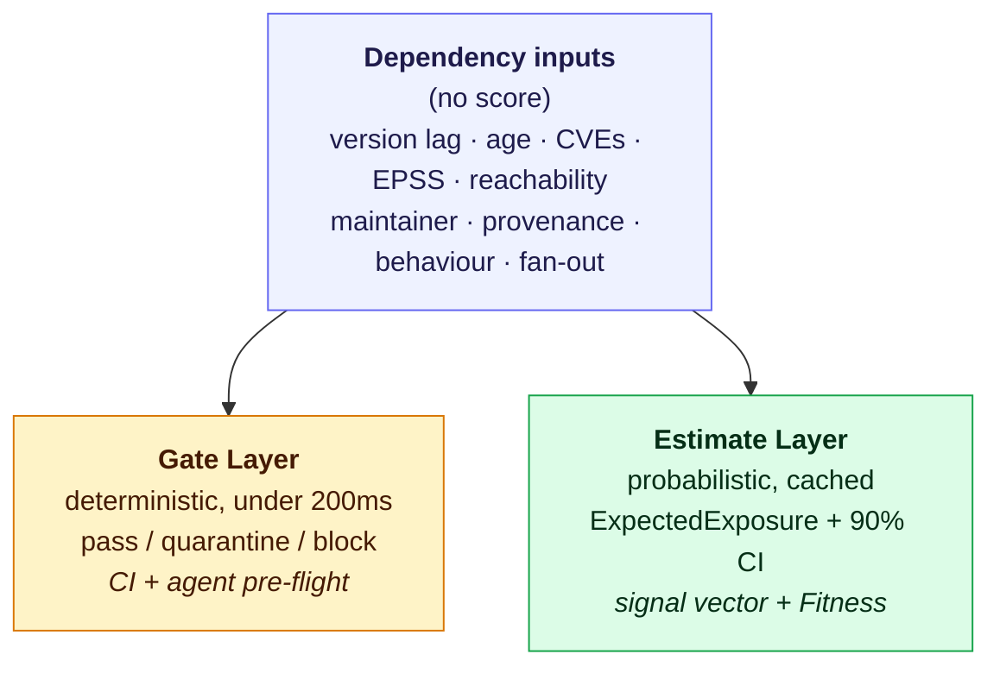

# Health Score

This is the target specification for the Health Score: what it computes, from which inputs,
with which constants. It describes the end state, not the current build.

## The idea in one sentence

A dependency's risk isn't one number — it's *how bad an incident would be* multiplied by
*how likely one is*. The Health Score keeps those two things separate instead of blending
them into a single 0–100 grade, and it does that once per dependency:

```
ExpectedExposure = Impact × P(incident)
P(incident)      = 1 - (1 - P_vuln) × (1 - P_supplychain)
```

`Impact` is the blast radius if something goes wrong. `P_vuln` is the odds a *known*
vulnerability gets exploited over the horizon `H` (default 365 days). `P_supplychain` is
the odds the package itself — this specific release — turns out to be malicious or
compromised, independent of any known CVE. A weighted score can't tell you which of those
is driving the number; keeping them apart can.

There are no pillar weights anywhere in this model. Probabilities combine
probabilistically, impact multiplies. The only top-level knobs are the horizon `H`, the
impact tiers, and the risk appetite threshold.

## Design principles

1. **Likelihood and impact are separate axes.** Never collapse "how likely" and "how bad"
   into one number before the user can see both.
2. **Quantify exposure windows, not snapshots.** The unit of risk is *time exposed ×
   probability while exposed*, not "vulnerable right now: yes/no."
3. **Freshness is a security metric in both directions.** Far behind widens the exposure
   window; bleeding-edge raises supply-chain trust risk. Both are risk.
4. **Two threat models, two channels.** Known-vulnerability risk and malicious-publish /
   takeover risk are modelled separately — a CVE database cannot see a zero-day publish.
5. **Popularity is blast radius, never a safety discount.** A compromised package reused
   everywhere is *more* dangerous.
6. **Honest uncertainty.** Unknown inputs widen the confidence interval; they never
   silently default to "fine."
7. **Actionable decomposition.** Every estimate ships with a signal vector that maps to a
   concrete action: update, quarantine, replace, or fund.
8. **Gate ≠ grade.** The deterministic pre-flight verdict is computed independently of the
   probabilistic estimate.

### Not in scope

Code quality of the dependency, functional suitability or performance, license
compatibility, and a single context-free 0–100 "truth" number. The 0–100 Fitness value
this model does emit is a labelled projection of the probability, never the source of
truth.

## Two jobs, not one number

Health Score is two mechanisms over one set of inputs:





- **The Gate** — a fast, deterministic checklist: `pass`, `quarantine`, or `block`. No
  probabilities, no math, just rules — the kind of check that can run inline in CI or
  before an agent runs `npm install`.
- **The Estimate** — the probability math above, meant for prioritizing a whole dependency
  tree, not gating a single install.

They're independent on purpose. A package can fail the Gate outright (it's deprecated)
regardless of what its ExpectedExposure would have been. Verification belongs where the
decision is made; prioritization belongs in the report.

## The Gate

Lives in [`ossiq.risk.gate`](../../src/ossiq/risk/gate.py):

```python
def get_gate_decision(record: ScanRecord, cooldown_days: int = 7) -> GateDecision: ...
```

`GateDecision` is `tuple[GateStatus, str]` — a verdict plus a human-readable reason.
`GateStatus` is `"pass"`, `"quarantine"`, or `"block"`. The checks run in a fixed order,
and the first match wins:

1. **Block** — the installed package doesn't exist on the registry (a hallucinated or
   slopsquatted name).
2. **Block** — the name's similarity to a popular package exceeds `TYPOSQUAT_THRESHOLD`
   (0.85). The reason names the target it resembles.
3. **Block** — a critical-severity, *reachable* CVE has an available fix that hasn't been
   applied. Until reachability analysis exists, reachability is treated as unknown and the
   condition falls back to severity plus fix availability.
4. **Block** — the package is deprecated by its maintainers.
5. **Quarantine** — the installed version is younger than `cooldown_days` (default 7) —
   *unless* that version already has a known CVE, in which case the cooldown is pointless
   to enforce and the package passes instead. This mirrors the shipped solver's CVE bypass.
6. **Quarantine** — no verifiable provenance on a dependency whose `Impact` exceeds
   `PROVENANCE_GATE_IMPACT` (1.5).
7. Otherwise, **pass**.

The result is stored on `ScanRecord.gate_decision`. A non-positive `cooldown_days` disables
the cooldown rule. Gate verdicts are computed live and never cached across versions.

## The Exposure Window

Before asking "how likely is exploitation," the model needs to know: *for how long would
you actually be exposed if you had to react today?* That's the Exposure Window `W` — an
estimate in days, in [`ossiq.risk.exposure_window`](../../src/ossiq/risk/exposure_window.py):

```python
def compute_exposure_window(
    registry: ProjectPackagesRegistry,
    releases_lag: int | None,
    versions_diff_index: VersionsDifference,
) -> float | None: ...
```

It adds two clocks together:

- **Upgrade distance** — how far the installed version is from a safe one. A patch release
  is a short trip; a major version behind, with dozens of releases in between, is a long
  one:

  ```
  upgrade_distance_days = UPGRADE_BASE_DAYS × SEMVER_DISTANCE[diff] × (1 + log1p(releases_lag))
  ```

  `SEMVER_DISTANCE` weights `LATEST` at `0.0`, `PATCH`/`PRERELEASE`/`BUILD` at `0.15`,
  `MINOR` at `0.45`, `MAJOR` at `1.0`. Version lag is a *predictor of window width*, never
  a standalone penalty.

- **Expected patch latency** — how long *this project* takes to ship a fix once one is
  needed, read off a Kaplan–Meier survival curve `S(t) = P(fix not yet shipped at time t)`
  fitted over its historical disclosure→fix intervals:

  ```
  expected_patch_latency = 0.5 × median_fix_days + 0.5 × tail_fix_days   # P50 and P90 of S(t)
  ```

  Unresolved CVEs are right-censored — they are exactly the cases that matter most. Below
  `MIN_FIX_EVENTS` (5) observed fix events the curve falls back to an ecosystem prior
  (`ECOSYSTEM_FIX_PRIOR`: PyPI 30/90 days median/tail, npm 14/60) **and widens the
  confidence interval**.

```
W = upgrade_distance_days + expected_patch_latency
```

The result is stored on `ScanRecord.exposure_window_days`. Survival curves are precomputed
and cached, refreshed weekly.

This is where freshness and maintenance live. Neither is a scored pillar: lag sets the
upgrade term, maintenance health sets the patch-latency term. A stale but feature-complete
package with a huge community gets a *short* window — someone will fork or fix it fast. A
fresh package with one exhausted maintainer gets a *long* one.

### Maintenance signals

Maintenance never adds or subtracts points. It parameterizes the patch-latency curve and
the survival prior when history is thin:

| Signal | Meaning |
|---|---|
| `bus_factor` | contributor concentration; 1 = single point of failure |
| `release_cadence_trend` | `declining` / `stable` / `growing` |
| `velocity` | commits per month |
| `deprecated` | Gate block, and a long patch latency in the estimate |

High bus-factor risk or declining cadence stretches `expected_patch_latency`, which widens
`W`, which raises `P_vuln`. Coupling, not addition.

## Known-vulnerability hazard — `P_vuln`

`P_vuln` answers: given the CVEs a package has, how likely is one to actually get exploited
while you're exposed? EPSS (an empirical, actively-updated exploit probability) times
reachability, accrued across the Exposure Window — deliberately not CVSS severity buckets.
CVSS is used only for impact sizing and for the Gate's critical-CVE rule.

Per CVE the inputs are `epss` (0–1), `reachable ∈ {True, False, None}`, `fix_available`,
and `fix_age_days`.

```python
REACH_FACTOR = {True: 1.0, None: REACH_UNKNOWN, False: REACH_UNREACHABLE}  # 1.0 / 0.5 / 0.1

# 1. Per-CVE daily hazard rate from EPSS × reachability.
def cve_hazard_rate(cve) -> float:
    p_annual = clamp(cve.epss, 0.0, 0.99) * REACH_FACTOR[cve.reachable]
    return -log(1 - p_annual) / 365.0

# 2. Accumulate across CVEs as competing risks — no additive stacking, no per-CVE caps.
lambda_total = sum(cve_hazard_rate(c) for c in cves)

# 3. Accrue over the exposure window, capped at the horizon.
P_vuln = 1 - exp(-lambda_total * min(W, H))

# 4. Negligence amplifier: a fix existed and wasn't applied.
if any(c.fix_available and c.fix_age_days > PATCH_SLA_DAYS for c in cves):
    P_vuln = 1 - (1 - P_vuln) * (1 - NEGLIGENCE_BUMP)

P_vuln = clamp(P_vuln, 0.0, 1.0)
```

Illustrative results at `H = 365`:

| Scenario | EPSS | Reachable | W (days) | `P_vuln` |
|---|---|---|---|---|
| No CVEs | – | – | 120 | 0.00 |
| 1 CVE, low exploit, unreachable | 0.02 | False | 120 | ~0.001 |
| 1 CVE, low exploit, reachable | 0.04 | True | 120 | ~0.013 |
| 1 CVE, high exploit, reachable | 0.70 | True | 410 | ~0.79 |
| 1 CVE, high exploit, unreachable | 0.70 | False | 410 | ~0.13 |
| 2 reachable CVEs, fix unapplied 120d | 0.30, 0.20 | True | 410 | ~0.55 → 0.62 |

A critical-severity CVE nobody has ever exploited, in code you never call, contributes
almost nothing. A moderate-severity CVE with high real-world exploitation and a reachable
call path dominates.

### Reachability

Reachability arrives in phases, and its absence is stated rather than hidden:

- **Phase 1** — `reachable = None` for every CVE: factor `0.5`, wider confidence interval.
- **Phase 2** — call-graph analysis for the top ecosystems: does our code path reach the
  vulnerable symbol? `reachable ∈ {True, False}`.
- **Phase 3** — runtime/dynamic confirmation.

Even the Phase 1 default is more honest than treating every CVE as fully live.

## Supply-chain hazard — `P_supplychain`

Lives in [`ossiq.risk.p_supplychain`](../../src/ossiq/risk/p_supplychain.py):

```python
def compute_p_supplychain(
    record: ScanRecord,
    cooldown_days: int = 7,
    fresh_hazard_weight: float = 0.20,
) -> float | None: ...
```

This is the channel that catches a compromised maintainer account publishing a malicious
version — a zero-day at publish time, which a CVE database cannot see until well after the
fact. It is a first-class hazard channel, not a bag of metadata flags.

Each sub-hazard is an annualized probability; they combine as a union,
`1 - Π(1 - hazard_i)`:

| # | Sub-hazard | Condition | Value |
|---|---|---|---|
| S1 | Cooldown / freshness | `version_age_days < COOLDOWN_DAYS` | `FRESH_HAZARD × (1 - age / COOLDOWN_DAYS)` |
| S2 | Maintainer takeover | maintainer changed within `TAKEOVER_WINDOW_DAYS` | `MAINTAINER_CHANGE_HAZARD` |
| S2 | Weak 2FA posture | publisher account lacks enforced 2FA | `WEAK_2FA_HAZARD` |
| S3 | New behavioural capability | install script / network-in-install / `eval` / fs write appearing where it wasn't | `BEHAVIOR_HAZARD[flag]` |
| S5 | Typosquat residual | `typosquat_similarity > TYPOSQUAT_THRESHOLD` and it passed the Gate | `TYPOSQUAT_HAZARD` |

Then S4: valid provenance (Sigstore/SLSA present and consistent) multiplies the union by
`PROVENANCE_TRUSTED_MULT` (0.6). Provenance **lowers but never zeroes** the hazard —
provenance proves origin, not safety; a signed orphan commit is still a signed orphan
commit.

```
P_supplychain = clamp((1 - Π(1 - hazard_i)) × provenance_mult, 0.0, 1.0)
```

Illustrative results:

| Scenario | Sub-hazards | Provenance | `P_supplychain` |
|---|---|---|---|
| Established, signed, stable | none | trusted ×0.6 | ~0.00 |
| Popular but 3-day-old release | fresh 0.11 | none | ~0.11 |
| New maintainer + install script appeared | 0.15, 0.20 | none | ~0.32 |
| Typosquat that slipped the Gate | 0.30 | none | ~0.30 |
| Quiet, popular, no known CVE | judged on its own trust signals | per signals | **not auto-zeroed** |

That last row is deliberate. There is no "stable and feature-complete" bonus and no
popularity discount — that combination is exactly the takeover-sleeper profile (popular +
quiet + no *known* CVE) that xz and qix matched. Packages like moment.js score well because
their abandonment hazard is low and their window is short, not because a heuristic waved
them through.

`P_supplychain` returns `None` (not zero) when the version's publish date isn't known, and
is stored on `ScanRecord.p_supplychain`.

## Impact / blast radius

Impact is what an incident costs you, computed independently of how likely it is:

```python
def impact(dep) -> float:
    TIER = {'runtime': 1.0, 'build': 0.7, 'dev': 0.3}[dep.tier]
    fan      = 0.5 + 0.5 * normalized_fan_out(dep)                       # 0.5..1.0
    exec_cap = INSTALL_EXEC_MULT if dep.runs_code_at_install else 1.0
    reach    = 1.0 + TRANSITIVE_REACH_COEF * log1p(dep.transitive_count)
    pop      = 1.0 + POPULARITY_BLAST_COEF * log1p(dep.monthly_downloads / 1e6)
    return TIER * fan * exec_cap * reach * pop
```

- **Tier** — a dev-only dependency is worth less than a runtime one.
- **Fan-out** — the share of internal modules or build steps that actually depend on it.
- **Install-time execution** — a package that runs code at install or import (npm
  `preinstall`, a `.pth` file) can act before you ever call it.
- **Transitive reach** — the depth and breadth of what it drags in.
- **Popularity** — raises Impact. More reuse means a bigger downside, so popularity never
  discounts a risk score; it enlarges the blast radius.

## Combining and uncertainty

Point estimates hide missing data. The full estimate propagates input distributions through
Monte Carlo, so degraded inputs produce a visibly wider band rather than fake precision:

```python
def estimate_exposure(dep, H=365, n=2000) -> dict:
    samples = []
    for _ in range(n):
        W   = sample_window(dep)            # survival-curve uncertainty
        pv  = sample_p_vuln(dep, W, H)      # EPSS draw + reachability prior
        psc = sample_p_supplychain(dep)     # trust sub-hazard draws
        imp = sample_impact(dep)
        samples.append(imp * (1 - (1 - pv) * (1 - psc)))
    return {
        "expected_exposure": mean(samples),
        "ci_90": (percentile(samples, 5), percentile(samples, 95)),
        "p_incident": ...,
        "confidence": confidence_label(dep),
    }
```

A package with EPSS but no reachability data and a thin patch history gets a wide interval;
a fully instrumented one gets a narrow interval. Missing EPSS uses an ecosystem prior and
widens the interval — never a silent zero.

Monte Carlo is optional: with it off, `P_vuln` and `P_supplychain` are closed-form and the
estimate is a point value with a `confidence` label.

## Project-level aggregation

Expected loss is additive. Averaging buries a single bad dependency among many healthy ones:

```python
project_expected_exposure = sum(e["expected_exposure"] for e in estimates)
```

Alongside the total, the report foregrounds the **Pareto tail** — the smallest set of
dependencies covering `TAIL_SHARE` (80%) of total exposure — plus the list of Gate blocks.
The action list is "fix these four," not "your project is a 73."

## The signal vector

Every estimate ships with its decomposition, so the number is never a black box:

```json
{
  "expected_exposure": 0.18,
  "ci_90": [0.09, 0.31],
  "p_incident": 0.22,
  "channels": {"p_vuln": 0.14, "p_supplychain": 0.09},
  "exposure_window_days": 410,
  "drivers": [
    "runtime dependency (impact tier 1.0)",
    "2 majors behind, ~520d lag → wide upgrade window",
    "expected_patch_latency 64d (low maintenance velocity, bus_factor=1)",
    "1 known CVE, EPSS 0.04, not reachable → low vuln hazard",
    "version age 3d → cooldown trust hazard"
  ],
  "fitness_projection": 71,
  "confidence": "medium (no reachability data; EPSS present)"
}
```

Each driver has to map to an action: update, quarantine, replace, or fund.

## Fitness — the 0–100 projection

For stakeholders who want one familiar number:

```python
def fitness_projection(expected_exposure: float) -> int:
    return round(100 * exp(-FITNESS_K * expected_exposure))
```

Monotonic, presentation only, explicitly labelled as a projection. The mapping is *fitted*
so that score deciles match observed incident rates — calibrated, not asserted. It is never
the source of truth and never the thing a gate reads.

## Data sources

| Signal | Source |
|---|---|
| version lag, `releases_lag`, age | npm / PyPI registry adapters |
| CVEs | OSV |
| deprecation, transitive tree, fan-out | solver / adapters |
| maintainer activity, bus factor | GitHub |
| EPSS | FIRST EPSS API (refreshed daily — it moves) |
| reachability | call-graph analysis (phased) |
| provenance | registry attestations (Sigstore/SLSA) |
| behavioural capability flags | tarball static analysis |
| patch-latency survival curves | derived from OSV + release history, cached weekly |

Everything derives from manifests, lockfiles, and public APIs. No customer input, no
questionnaire.

## Tuning parameters

```python
# Horizon & appetite
HORIZON_DAYS = 365
RISK_APPETITE = 0.15          # ExpectedExposure above this trips a portfolio alert

# Exposure window
UPGRADE_BASE_DAYS = 30
SEMVER_DISTANCE = {'LATEST': 0.0, 'PATCH': 0.15, 'MINOR': 0.45, 'MAJOR': 1.0}
MIN_FIX_EVENTS = 5            # below this, use the ecosystem prior and widen the CI

# Vulnerability hazard
REACH_UNKNOWN = 0.5
REACH_UNREACHABLE = 0.1
PATCH_SLA_DAYS = 30
NEGLIGENCE_BUMP = 0.15

# Supply-chain trust hazard
COOLDOWN_DAYS = 7             # matches the shipped solver's VERY_FRESH threshold
FRESH_HAZARD = 0.20
TAKEOVER_WINDOW_DAYS = 90
MAINTAINER_CHANGE_HAZARD = 0.15
WEAK_2FA_HAZARD = 0.05
TYPOSQUAT_THRESHOLD = 0.85
TYPOSQUAT_HAZARD = 0.30
PROVENANCE_TRUSTED_MULT = 0.6
BEHAVIOR_HAZARD = {
    'new_install_script': 0.20,
    'new_network_in_install': 0.50,
    'new_eval_usage': 0.30,
    'new_fs_write': 0.15,
}

# Impact / blast radius
INSTALL_EXEC_MULT = 1.3
TRANSITIVE_REACH_COEF = 0.05
POPULARITY_BLAST_COEF = 0.1   # popularity RAISES impact
PROVENANCE_GATE_IMPACT = 1.5  # above this, missing provenance quarantines

# Aggregation & projection
TAIL_SHARE = 0.80
FITNESS_K = 4.0               # calibrated; presentation only
```

## Edge cases

| Case | Behaviour |
|---|---|
| No CVEs, healthy, established | `P_vuln ≈ 0`, `P_supplychain ≈ 0` → low exposure |
| Zero dependencies | `project_expected_exposure = 0` |
| Everything on latest | short window, but the trust channel still applies — a brand-new malicious "latest" is caught by cooldown |
| Deprecated | Gate `block` + long patch latency in the estimate |
| Workspace / internal package | skipped, not external |
| No EPSS for a CVE | ecosystem prior + widened CI, never zero |
| Thin patch history (< 5 fixes) | ecosystem prior curve + widened CI |
| Feature-complete (moment.js) | low abandonment hazard + short window, with no special-case bonus |
| Popular + quiet + no known CVE | not auto-trusted; the trust channel is judged on its own signals |
| Unknown publish date | `P_supplychain` is `None`, not `0.0` |

## Validation

The model is judged on whether its probabilities come true, not on whether experts agree
with its numbers.

**Dataset.** Historical snapshots of N projects at time `T`, with realized outcomes over
`[T, T+H]` — did the package get a disclosed CVE, a malicious publish, or a yank? A
backtest, not an expert poll.

**Targets.**

- **Calibration** — Brier score < 0.12 on held-out incidents; reliability-curve deviation
  < 0.05 across deciles.
- **Discrimination** — AUC > 0.80 separating packages that had an incident in the following
  horizon from those that didn't.
- **Tail capture** — ≥ 90% of realized incident exposure concentrated in the top-risk
  quintile.
- **Coverage honesty** — estimates built on degraded inputs carry visibly wider intervals.

**Method.** Time-split backtest (train `[T-2H, T-H]`, test `[T-H, T]`). Fit hazard priors
and `FITNESS_K` on train; report Brier, reliability curve, AUC, and tail capture on test.
Adjust one prior at a time, and accept a change only if test calibration improves and AUC
does not regress. Never tune a constant so that a named package hits a target value.

## Performance targets

| Path | Budget |
|---|---|
| Gate verdict | < 200 ms per package — it runs inline in CI and in an agent's pre-install loop |
| Estimate, closed form | < 2 s per project (50 deps), cached |
| Estimate, Monte Carlo `n=2000` | amortized < 2 s; embarrassingly parallel and cached |
| Cost | < $0.01 per scan at > 90% cache hit rate |

Percentile and survival-curve caches refresh weekly, EPSS daily; the Gate is computed live.
