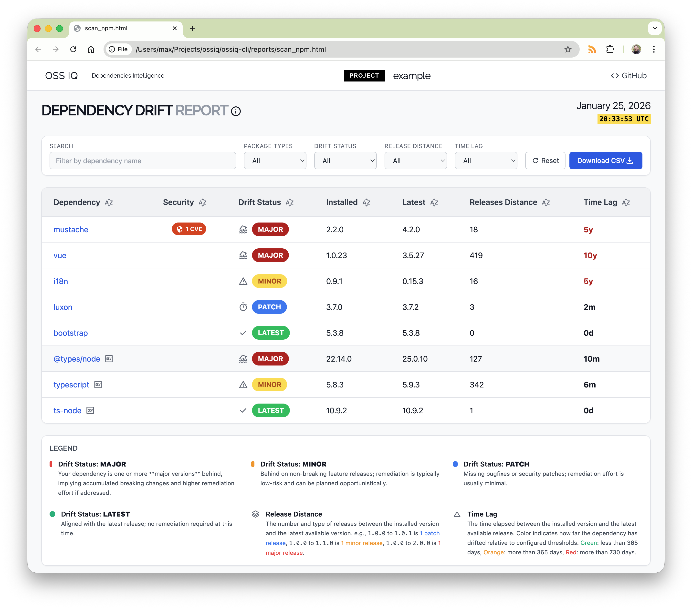

# First Analysis with OSS IQ

In this tutorial, you will run your first dependency analysis with OSS IQ. You'll learn how to scan a local project, interpret the results from the command line, and generate an interactive HTML report to explore dependency health in-depth. This guide focuses on understanding version drift, transitive risk, and maintenance health—not just CVEs.

**What you'll build:**

By the end, you'll have performed a full dependency analysis and know how to use the `ossiq-cli` to assess any project's dependencies.

**Prerequisites:**

- Python 3.11+
- Basic familiarity with the command line

**Time to complete:** 10-15 minutes

---

## Step 1: Install OSS IQ

First, install the `ossiq-cli` package using `pip`.

```bash
pip install ossiq-cli
```

After installation, verify that it was successful by checking the version:

```bash
ossiq-cli --version
```

You should see output similar to `ossiq-cli, version 0.1.0`.

---

## Step 2: Add a GitHub Token

OSS IQ queries the GitHub API to gather repository health data for each dependency. Without authentication, GitHub limits requests to 60 per hour, which is not enough for most projects.

1.  Create a GitHub Personal Access Token (PAT). You can follow the [official GitHub documentation](https://docs.github.com/en/authentication/keeping-your-account-and-data-secure/managing-your-personal-access-tokens#creating-a-personal-access-token-classic). The token needs **no special scopes**—public repository access is sufficient.

2.  Set the token as an environment variable named `OSSIQ_GITHUB_TOKEN`. This is the recommended way to provide the token to OSS IQ.

    ```bash
    export OSSIQ_GITHUB_TOKEN="your_github_pat_here"
    ```
    
    !!! tip "Using GitHub CLI"
        If you use the official [GitHub CLI](https://cli.github.com/), you can easily get a token and set the variable in one command:
        ```bash
        export OSSIQ_GITHUB_TOKEN=$(gh auth token)
        ```

---

## Step 3: Set Up the Sample Project

Now, let's create a small sample Python project to analyze. Create a new directory and inside it, a `requirements.txt` file.

```bash
mkdir ossiq-sample-project
cd ossiq-sample-project
touch requirements.txt
```

Open `requirements.txt` and add the following dependencies:

```
# requirements.txt
requests==2.28.1
click==8.1.3
```

We are using older versions of these popular packages to demonstrate how OSS IQ highlights outdated dependencies and potential vulnerabilities.

---

## Step 4: Run Your First Analysis

With your sample project ready, you can now run the `scan` command. `ossiq-cli` will automatically detect the `requirements.txt` file in the current directory.

Run the scan from within the `ossiq-sample-project` directory:

```bash
ossiq-cli scan .
```

You should see console output that looks something like this:

```
╭───────────────────────────────────────────────╮
│ 📦 Project: ossiq-sample-project              │
│ 🔗 Packages Registry: PyPI                    │
│ 📍 Project Path: /path/to/ossiq-sample-project│
╰───────────────────────────────────────────────╯

                         Production Packages Version Status
┏━━━━━━━━━━━━┳━━━━━━┳━━━━━━━━━━━━┳━━━━━━━━━┳━━━━━━━━━┳━━━━━━━━━━━━━┳━━━━━━━━━━┓
┃ Dependency ┃ CVEs ┃ Lag Status ┃ Installed ┃ Latest  ┃ Release Lag ┃ Time Lag ┃
┡━━━━━━━━━━━━╇━━━━━━╇━━━━━━━━━━━━╇━━━━━━━━━╇━━━━━━━━━╇━━━━━━━━━━━━━╇━━━━━━━━━━┩
│ requests   │  1   │   Minor    │ 2.28.1    │ 2.31.0  │           5 │      1y+ │
│ click      │      │   Minor    │ 8.1.3     │ 8.1.7   │           4 │     ~1y  │
└────────────┴──────┴────────────┴─────────┴─────────┴─────────────┴──────────┘
```

---

## Step 5: Understand the Console Output

The console output gives you a high-level summary of your dependencies' health. Here's what the columns mean:

-   **CVEs**: The number of known Common Vulnerabilities and Exposures for the installed version of the package. `requests==2.28.1` has a known vulnerability.
-   **Lag Status**: Categorizes how far behind the installed version is from the latest version (e.g., `Major`, `Minor`, `Patch`, `Latest`).
-   **Installed**: The version of the package currently in your project.
-   **Latest**: The most recent stable version available in the package registry.
-   **Release Lag**: The number of versions released between your installed version and the latest version. A high number indicates significant divergence.
-   **Time Lag**: The amount of time that has passed since your installed version was released.

This view quickly shows you that `requests` has a security issue and both packages are lagging behind their latest versions.

---

## Step 6: Generate and Explore the HTML Report

While the console output is useful for a quick overview, the interactive HTML report provides a much richer experience for exploring your dependencies.

Generate the report by running the `scan` command again with the `--presentation html` flag.

```bash
ossiq-cli scan . --presentation html --output report.html
```

This will create a `report.html` file in your project directory. Open this file in your web browser.

You'll see a detailed, interactive report where you can:

-   Filter dependencies by name.
-   Sort by different metrics like **Time Lag** or **Release Lag**.
-   Click on a package to see more details, including a direct link to its repository and a list of CVEs.



---

## What You've Learned

Congratulations! You've successfully performed your first dependency analysis with OSS IQ. You now know how to:

<span class="material-symbols-outlined marker-check">check</span> Install and configure `ossiq-cli`.

<span class="material-symbols-outlined marker-check">check</span> Run a dependency scan on a local project.

<span class="material-symbols-outlined marker-check">check</span> Interpret the summary table in the console output.

<span class="material-symbols-outlined marker-check">check</span> Generate an interactive HTML report for in-depth analysis.

## Next Steps

Now that you've run your first scan, you can start integrating OSS IQ into your regular development workflow.

-   **Automate with CI/CD**: Learn how to set up a [Quality Gate with GitHub Actions](./tutorial-github-actions.md) to automatically scan pull requests.
-   **Explore Metrics**: Dive deeper into the metrics OSS IQ provides in the [Explanation](/explanation/) section.
-   **Read How-To Guides**: Check out the [How-To Guides](/how-to-guides.md) for more advanced use cases.
